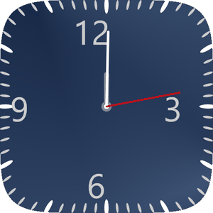
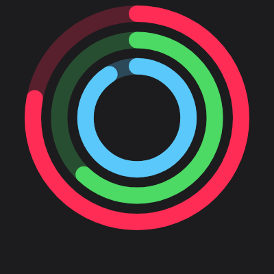
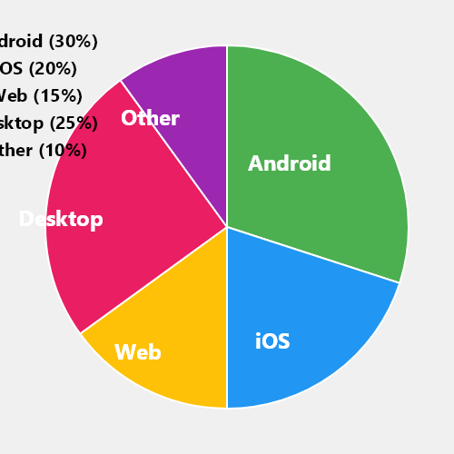
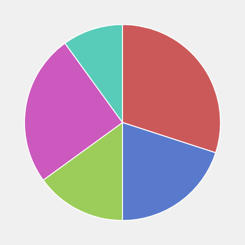
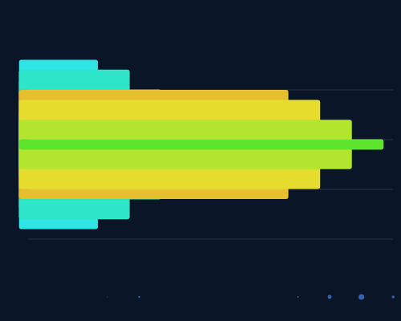
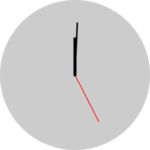
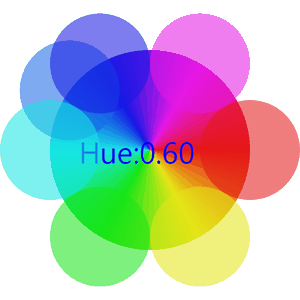
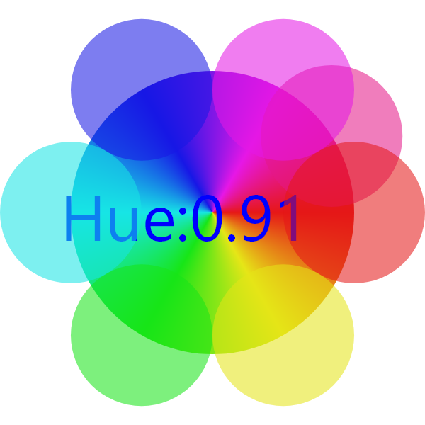

# RemoteUI — Python Remote Compose Generator and Player

**A Python generator and experimental player for RemoteCompose binary UI documents.**

RemoteUI lets you programmatically create tiny binary `.rc` files that describe complete user interfaces — clocks, charts, gauges, animated graphics — renderable on Android or any compliant player. The **generator** is strongly validated and production-ready. The **player** is an in-development desktop renderer useful for testing, visualization, and demos.

<p align="center">
  
  
  
</p>

<p align="center">
  <em>All generated from Python. The metal clock is 2KB. The activity rings are 3KB. The pie chart is 4KB.</em>
</p>

---

## What Are `.rc` Files?

`.rc` (Remote Compose) files are a compact binary format for describing UI layouts, drawing operations, animations, and interactivity. Think of them as tiny self-contained UI programs:

- **A complete animated clock** in under 2KB
- **An interactive pie chart with labels** in under 4KB
- **Touch-responsive sliders and gauges** in a few KB

The format is based on Android's [Remote Compose](https://android.googlesource.com/platform/frameworks/support/+/refs/heads/main/compose/remote/) project. Documents use an RPN expression engine for animation and data binding — no scripting language, just a stack of math operations that the player evaluates each frame.

---

## Upstream Source & Attribution

This project is a Python port of the **Java/Kotlin Remote Compose creation library** from the [AndroidX `compose/remote` tree](https://android.googlesource.com/platform/frameworks/support/+/HEAD/compose/remote/), part of the Android Open Source Project.

**What was ported:** The Python `rcreate/` package reimplements the public API of the Java `remote-creation-core` module — the binary writer (`RemoteComposeWriter`), opcode serialization (`RemoteComposeBuffer`), expression system, modifier stack, paint state, path builder, and all layout/drawing operations. The Python API mirrors the Java class and method structure, with a Pythonic `RcContext` DSL layered on top.

**How it was validated:** The Kotlin demo suite in the upstream repository generates `.rc` reference files. The Python generator was validated by producing the same demos and comparing output byte-for-byte against 171 Kotlin-generated reference files. 145 of 171 (85%) match exactly; the remaining differences are explained (bitmap resources, RNG-dependent demos, known float precision edge cases). See [docs/VALIDATION.md](docs/VALIDATION.md) for the full breakdown.

**What was not ported:** The Java/Kotlin *player* runtime, layout engine, and Android rendering stack were not ported — those are separate upstream modules. The Python `rplayer/` is an independent implementation of a desktop renderer, not a port of the Android player.

The original source is copyright The Android Open Source Project, licensed under Apache 2.0.

---

## Showcase

*The images below are rendered by the Python player from selected demos it handles well. The player does not yet support all features (see [Current Status](#current-status)).*

### Data Visualization

<p align="center">
  
  
  
</p>

<p align="center">
  <em>Pie charts with text labels (4KB) | HSV golden-ratio colors (944 bytes) | Horizontal bar chart (4KB)</em>
</p>

### Clocks and Animation

<p align="center">
  
  
  
</p>

<p align="center">
  <em>Metallic clock face with superellipse clip, sweep gradient, and three hands (2KB) | Minimal clock (637 bytes) | Animated HSV color wheel with expression-driven hue (2KB)</em>
</p>

### Static Elements

<p align="center">
  
  
  
</p>

<p align="center">
  <em>Apple Watch-style activity rings (3KB) | The simplest possible .rc file (128 bytes) | HSV color expression wheel (2KB)</em>
</p>

---

## What This Project Includes

### Generator (`rcreate/`) — Stable

A complete, strongly validated Python port of the Java/Kotlin RemoteCompose creation library. Two API levels:

- **`RcContext`** — Pythonic DSL with context managers, expression builders (`RFloat`, `RInt`), and operator overloading
- **`RemoteComposeWriter`** — Low-level writer matching Java's API (~190 methods)

The generator produces byte-identical output to the original Java/Kotlin library for 85% of reference files. No external dependencies — Python 3.10+ stdlib only.

### Player (`rplayer/`) — Experimental

An in-development Python renderer and viewer for `.rc` files. Uses [skia-python](https://github.com/aspect-build/skia-python) for Skia-native rendering. Useful for testing, visualization, and demos, but not yet feature-complete:

- **Desktop viewer** with play/pause, time stepping, and file browsing
- **CLI renderer** for batch PNG/frame generation
- **Expression evaluator** with 40+ math ops, time/touch/sensor variables
- **Path and shape rendering** including runtime-constructed paths and arc/conic/cubic curves

Not yet implemented: layout engine (column/row positioning), bitmap font rendering, `buildPathFromText`, full touch/sensor input forwarding. See [Current Status](#current-status) for details.

### Demos (`demos/`)

219 demo scripts across multiple categories generating `.rc` files that exercise every feature of the format.

---

## Quick Start

### 1. Clone and set up

```bash
git clone https://github.com/Jason-Hoford/RemoteUI.git
cd RemoteUI
python -m venv .venv

# Windows
.venv\Scripts\activate

# macOS/Linux
source .venv/bin/activate

pip install skia-python
```

### 2. Generate all demos

```bash
python demos/run_all.py
```

This creates 219 `.rc` files in `demos/output/`.

### 3. View in the desktop player

```bash
# Browse all demos
python -m rplayer.viewer demos/output/

# Open a specific file
python -m rplayer.viewer demos/output/demo_metal_clock.rc
```

Controls: **Space** = play/pause, **Arrow keys** = step frames, **Page Up/Down** = browse files.

### 4. Render to PNG

```bash
# Single frame
python -m rplayer demos/output/demo_metal_clock.rc -t 0.5

# Animated sequence (5 seconds at 10 fps)
python -m rplayer demos/output/demo_metal_clock.rc -d 5 -f 10
```

Output goes to `rplayer_frames/`.

---

## Writing Your Own `.rc` File

```python
from rcreate import RcContext, Rc
from rcreate.modifiers import RecordingModifier

ctx = RcContext(400, 400, "My Demo", api_level=7, profiles=0x200)

with ctx.root():
    with ctx.column(RecordingModifier().fill_max_size().background(0xFF1A1A2E)):
        # Header bar
        with ctx.box(RecordingModifier().fill_max_width().height(80.0)
                     .background(0xFF2244AA),
                     Rc.Layout.CENTER, Rc.Layout.CENTER):
            ctx.text("Hello RemoteUI", font_size=28.0, color=0xFFFFFFFF)

        # Canvas with a circle
        with ctx.box(RecordingModifier().fill_max_size(),
                     Rc.Layout.START, Rc.Layout.START):
            with ctx.canvas(RecordingModifier().fill_max_size()):
                ctx.painter.set_color(0xFFFF6633).commit()
                ctx.draw_circle(200.0, 250.0, 80.0)

ctx.save("my_demo.rc")
```

Then view it:

```bash
python -m rplayer.viewer my_demo.rc
```

---

## Current Status

### Generator

| Metric | Result |
|--------|--------|
| Demo generation | **219 / 219** pass |
| Encoding unit tests | **79 / 79** pass |
| Byte-identical reference matches | **145 / 171** (85%) |
| Android rendering verification | **11 demos** visually confirmed |
| External dependencies | **None** (Python 3.10+ stdlib only) |

The generator is **fully ported** — 100% of the portable Java public API surface is covered.

### Player (Experimental)

The player is under active development. It renders many demos correctly but does not yet implement all runtime features.

| Metric | Result |
|--------|--------|
| Demos rendering (non-blank) | **136 / 222** (61%) |
| Rendering engine | skia-python (Skia C++ via Python bindings) |
| Expression evaluator | 40+ math ops, time/touch/sensor variables |
| Path support | Static paths, runtime-constructed paths, arc/conic/cubic |
| Color expressions | HSV, interpolate, select modes |

**What works well:** Canvas drawing operations, paths, gradients, text anchoring, paint state, matrix transforms, clip regions, loops, conditionals, float expressions, and time-driven animation.

**Not yet implemented:** Layout engine (column/row/wrap_content positioning), bitmap font rendering, `buildPathFromText`, full touch/sensor input forwarding, some modifier interactions. Demos that rely on the layout engine to position elements will render with overlapping content. See [docs/KNOWN_LIMITATIONS.md](docs/KNOWN_LIMITATIONS.md).

---

## Repository Structure

```
RemoteUI/
├── rcreate/                    # Python generator (stable, no external deps)
│   ├── writer.py               # RemoteComposeWriter (~190 methods)
│   ├── context.py              # RcContext DSL with context managers
│   ├── remote_UI_buffer.py     # Opcode serialization
│   ├── wire_buffer.py          # Big-endian binary read/write
│   ├── rc.py                   # Format constants
│   ├── remote_path.py          # Path builder
│   ├── types/                  # Expression types (RFloat, RInt, RMatrix)
│   ├── modifiers/              # Modifier system
│   └── actions/                # Action types for interactivity
├── rplayer/                    # Python player/renderer (experimental, requires skia-python)
│   ├── viewer.py               # Desktop viewer (tkinter + skia)
│   ├── renderer.py             # Skia rendering engine
│   ├── reader.py               # .rc binary parser
│   ├── runtime.py              # Expression evaluator and animation
│   └── expressions.py          # RPN expression engine
├── demos/                      # 219 demo scripts
│   ├── run_all.py              # Generate all demos
│   ├── verify_encoding.py      # 79 encoding unit tests
│   ├── components/             # Layout components and modifiers
│   ├── advanced/               # Clocks, graphs, touch, animation
│   ├── validation/             # Stress tests
│   └── output/                 # Generated .rc files
├── docs/                       # Documentation and assets
│   ├── assets/                 # Showcase screenshots and GIFs
│   ├── ARCHITECTURE.md         # Binary format, layer stack, conventions
│   ├── VALIDATION.md           # Validation workflow and results
│   ├── KNOWN_LIMITATIONS.md    # Gaps and platform differences
│   ├── PLAYER.md               # Player usage and capabilities
│   └── SETUP.md                # Setup and installation guide
└── LICENSE                     # Apache 2.0
```

---

## Why This Format Is Interesting

**Extreme compactness.** A full animated clock with metallic gradients, text, tick marks, and three moving hands fits in 2KB. A complete pie chart with 5 labeled segments is under 4KB. The simplest valid document is 128 bytes.

**No scripting, just math.** Animation and data binding use an RPN expression evaluator — a stack of float operations the player evaluates each frame. This means documents are safe to execute (no arbitrary code), fast to evaluate, and trivially serializable.

**Cross-platform rendering.** The same `.rc` file renders on Android (via RemoteComposePlayer), desktop Python (via this project's rplayer), or any future player implementation. The binary format is fully documented and version-tagged. The Android player is the reference implementation; the Python player covers the core drawing pipeline and is improving toward full parity.

**Server-side generation.** Documents can be created from Python scripts, web servers, or CI pipelines without JVM dependencies — then pushed to Android devices for rendering.

---

## Companion Project: Android Viewer

[RemoteComposeViewer-Android](https://github.com/Jason-Hoford/RemoteComposeViewer-Android) is a companion Android app that renders `.rc` files using the official `RemoteComposePlayer` from the upstream AndroidX library. It includes 177 built-in demos and can open custom `.rc` files from device storage.

The Android viewer was used as part of end-to-end validation: Python-generated `.rc` files were loaded into the viewer to confirm they render correctly on the reference Android player. 11 demos were visually verified this way, including 6 purpose-built validation demos that exercise edge cases not covered by byte-level comparison alone.

The typical workflow across both projects:

1. **Generate** `.rc` files using Python (`rcreate` package)
2. **Validate** output byte-for-byte against Kotlin reference files (`check_references.py`)
3. **Render on Android** using the viewer app (the reference player)
4. **Preview on desktop** with the Python player (`rplayer`) for quick iteration

---

## Documentation

| Document | Description |
|----------|-------------|
| [docs/ARCHITECTURE.md](docs/ARCHITECTURE.md) | Layer stack, binary format, key conventions |
| [docs/VALIDATION.md](docs/VALIDATION.md) | Three-level validation workflow and results |
| [docs/KNOWN_LIMITATIONS.md](docs/KNOWN_LIMITATIONS.md) | Unported APIs, platform differences |
| [docs/PLAYER.md](docs/PLAYER.md) | Player usage, viewer controls, CLI options |
| [docs/SETUP.md](docs/SETUP.md) | Setup, installation, and dependency guide |

---

## License

Apache 2.0 — see [LICENSE](LICENSE).

The `rcreate/` generator is a port of the Java/Kotlin Remote Compose creation library from the [AndroidX `compose/remote` tree](https://android.googlesource.com/platform/frameworks/support/+/HEAD/compose/remote/), copyright The Android Open Source Project, licensed under Apache 2.0.
